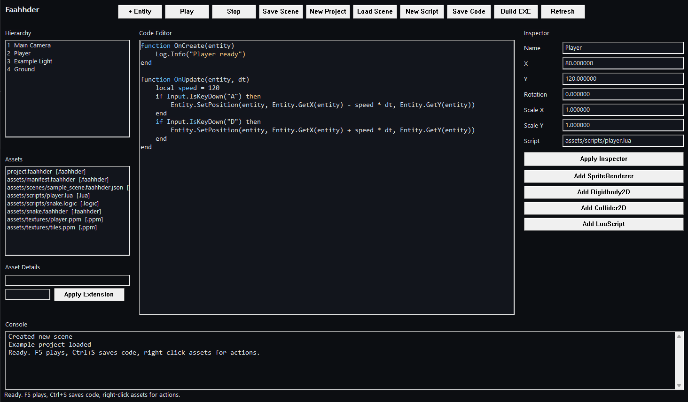

# Faahhder



Faahhder is a compact C++17 2D game engine with a native editor, standalone game runner, editable example project & runtime systems. It is built as a side-project

## What It Includes

- Native Windows editor executable: `Faahhder.exe`
- Core runtime library: `FaahhderRuntime`
- Standalone game runner: `FaahhderGame.exe`
- Asset packing CLI: `FaahhderPacker.exe`
- Editable Snake example project in `examples/snake`
- Build and export scripts in `scripts`

## Editor

- Hierarchy panel for scene entities
- Asset browser
- Multiline code editor
- Inspector
- Console panel
- Toolbar actions for Play, Stop, Save, New Project, New Script, Refresh, and Build EXE

The default project opens to the Snake example, so you can edit `assets/scripts/snake.logic`, save it, and press Play.

## Editor Workflow

```text
Ctrl+N      Create a new project
Ctrl+S      Save the active code file
F5          Play the current project
Shift+F5    Stop the launched game window
```

Typical flow:

1. Open `Faahhder.exe`.
2. Select a file from the asset browser.
3. Edit it in the code panel.
4. Press `Ctrl+S`.
5. Press `F5` or click `Play`.
6. Click `Build EXE` when you want a standalone output folder.

## Build

Configure and build:

```powershell
cmake -S . -B build/dev
cmake --build build/dev --config Release
```

The editor executable is written to:

```text
build/dev/src/Faahhder/Release/Faahhder.exe
```

## Run

```powershell
.\build\dev\src\Faahhder\Release\Faahhder.exe
```

Faahhder opens `examples/snake` by default. The Snake project is an editable example project, not hardcoded into the engine.

## Export A Game

From the editor, click:

```text
Build EXE
```

From the command line:

```powershell
.\scripts\build_project.ps1 -Project examples\snake
```

The exported game folder is written under `dist`

## Project Layout

```text
assets                Starter assets
docs                  Images
examples/snake        Default editable example project
scripts               Build and export scripts
src/Faahhder          Native editor executable
src/FaahhderGame      Standalone game runner
src/FaahhderRuntime   Core runtime systems
tools/FaahhderPacker  Asset packing CLI
```

Generated local folders:

```text
build                 CMake build output
dist                  Exported game folders and packaged engine zip
projects             Editor-created projects
```